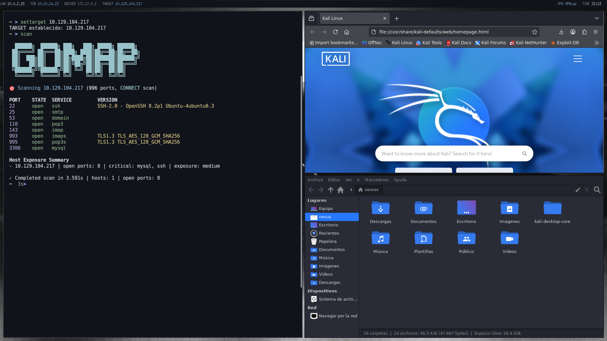
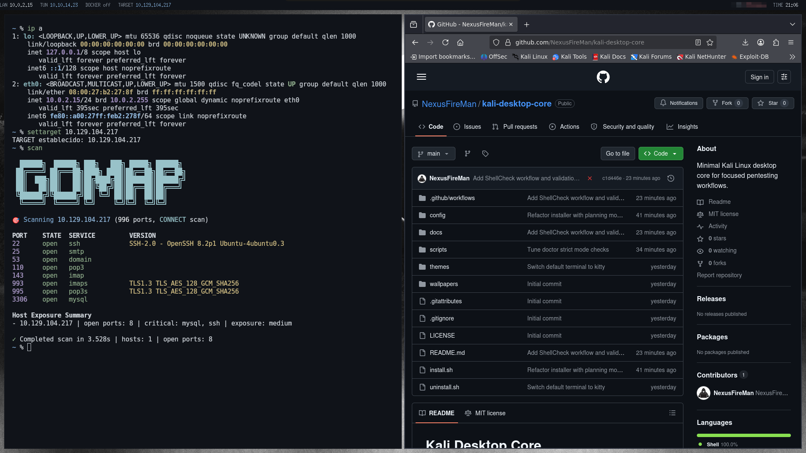
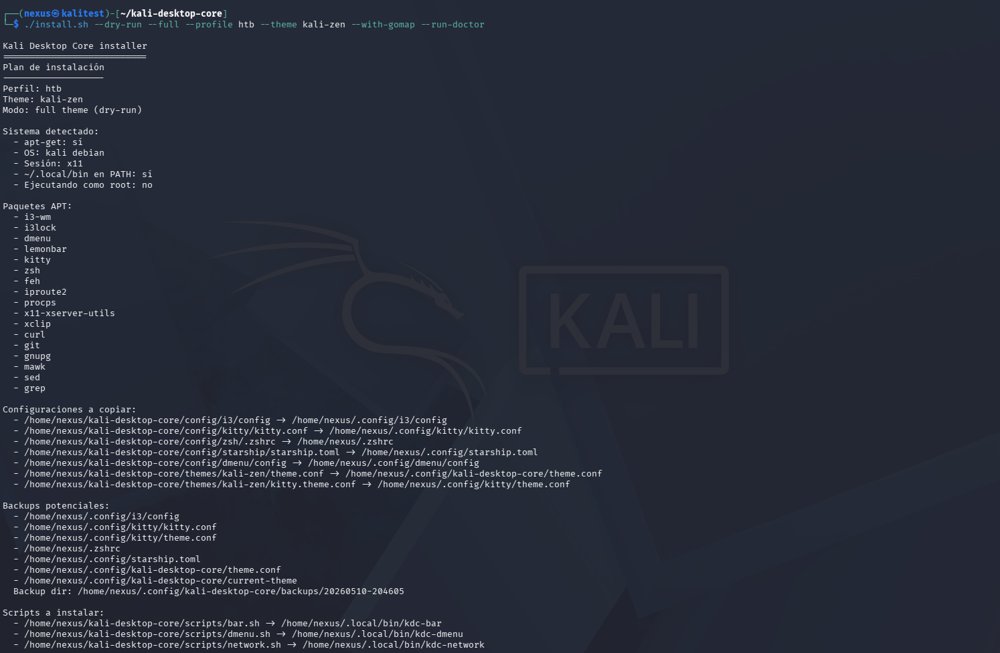

# Kali Desktop Core


Entorno de escritorio minimalista para Kali Linux orientado a pentesting real, máquinas virtuales y sesiones largas de trabajo sin fatiga visual.

<p align="center">
  
</p>

Entorno i3 minimalista con barra superior para LAN, VPN, Docker, TARGET y flujo de escaneo integrado con [gomap](https://github.com/NexusFireMan/gomap).

[Changelog](CHANGELOG.md) · [Release notes](RELEASE_NOTES.md)

## Para quién es

Kali Desktop Core está pensado como entorno principal de trabajo diario para seguridad ofensiva: pentesting, CTF, HTB/TryHackMe, bug bounty y laboratorios en VM.

No es un simple instalador de herramientas. El objetivo es ofrecer un workspace ligero y coherente para trabajar muchas horas con i3, lemonbar, kitty, zsh, starship, TARGET persistente y una barra centrada en señales útiles durante una sesión real.

Es especialmente útil si buscas:

- un entorno minimalista basado en i3/lemonbar en lugar de un escritorio completo
- bajo consumo en máquinas virtuales y equipos modestos
- menos distracciones y más foco durante reconocimiento, explotación y documentación
- integración práctica con flujos de TARGET, VPN, Docker y [gomap](https://github.com/NexusFireMan/gomap)
- una base personalizable sin convertir el escritorio en una colección pesada de extras

## Relationship with Kali-Parrot-Setup

[Kali-Parrot-Setup](https://github.com/NexusFireMan/Kali-Parrot-Setup) queda como bootstrap general y legacy para preparar entornos más amplios o multi-desktop: XFCE, Plasma, MATE y GNOME.

Kali Desktop Core es la línea moderna y enfocada: un entorno minimalista i3/lemonbar/kitty/zsh/starship para uso diario, sesiones largas y flujo real de pentesting. Prioriza rendimiento, foco, bajo consumo y una experiencia consistente antes que cubrir todos los escritorios posibles.

En la práctica:

- usa Kali-Parrot-Setup si quieres un bootstrap general para varios escritorios
- usa Kali Desktop Core si quieres el workspace ofensivo principal, minimalista y mantenido alrededor del flujo NexusFireMan

## Filosofía

Kali Desktop Core no busca verse bien en una captura. Busca sentirse sólido después de ocho horas de reconocimiento, pivoteo, debugging y terminales abiertas.

Principios del proyecto:

- rendimiento real sobre efectos visuales
- foco y reducción de distracciones
- contraste cómodo y sin blancos puros
- modularidad para adaptar temas, scripts y flujo de trabajo
- integración práctica con laboratorios, HTB y bug bounty

## Stack

- Window Manager: i3
- Launcher: dmenu
- Barra: lemonbar
- Terminal: kitty
- Shell: zsh
- Prompt: starship
- Compositor: ninguno

## Estructura

```text
.
├── .github/
│   └── workflows/
│       └── shellcheck.yml
├── README.md
├── CHANGELOG.md
├── LICENSE
├── RELEASE_NOTES.md
├── install.sh
├── uninstall.sh
├── config/
│   ├── kitty/
│   ├── dmenu/
│   ├── i3/
│   ├── starship/
│   └── zsh/
├── docs/
│   ├── screenshots/
│   ├── installation.md
│   ├── flujo_trabajo.md
│   ├── personalizacion.md
│   ├── release-checklist.md
│   └── themes.md
├── scripts/
│   ├── bar.sh
│   ├── gomap.sh
│   ├── network.sh
│   ├── target.sh
│   ├── dmenu.sh
│   ├── doctor.sh
│   ├── power-menu.sh
│   ├── refresh.sh
│   └── utils.sh
├── themes/
│   ├── default/
│   ├── kali-zen/
│   └── katana/
└── wallpapers/
```

## Características

- Barra ligera en `lemonbar` con IP local, VPN, Docker, TARGET, estado VPN y hora.
- Indicador central de workspaces en `lemonbar`, visible por defecto como `1 2 3 4 5`.
- Menú de sesión/power desde la barra.
- TARGET persistente compartido entre shell y barra.
- Alias y funciones útiles para flujos de pentesting.
- Temas intercambiables sin rehacer toda la configuración.
- Instalación modular con backups automáticos.
- Configuración pensada para VMs y equipos modestos.

## Dependencias principales

Paquetes usados por defecto en Debian/Kali:

- `i3-wm`
- `i3lock`
- `dmenu`
- `lemonbar`
- `kitty`
- `zsh`
- `feh`
- `iproute2`
- `procps`
- `x11-xserver-utils`
- `xclip`
- `curl`
- `git`
- `gnupg`
- `mawk`
- `sed`
- `grep`

`gomap`, `starship` y Docker se pueden instalar como extras explícitos con `--with-gomap`, `--with-starship` y `--with-docker`. En perfiles `htb` y `bugbounty`, `gomap` y Docker se activan por defecto salvo que uses `--without-gomap` o `--without-docker`.

## Instalación

### Instalación rápida

```bash
git clone https://github.com/nexusfireman/kali-desktop-core.git
cd kali-desktop-core
chmod +x install.sh uninstall.sh scripts/*.sh
./install.sh
```

Sin argumentos, `./install.sh` mantiene el comportamiento clásico: equivale a `./install.sh --full`, muestra un plan y aplica el tema `default`.

### Instalación interactiva

```bash
./install.sh --interactive
```

El modo interactivo usa preguntas simples en terminal para elegir perfil, tema y extras.

### Dry-run

```bash
./install.sh --dry-run --full --theme kali-zen
```

El dry-run muestra el plan de instalación sin ejecutar `apt-get`, crear backups, copiar archivos ni modificar `/etc/apt`.

### Perfiles

```bash
./install.sh --full --profile htb --theme kali-zen
```

Perfiles disponibles: `minimal`, `vm`, `htb`, `bugbounty` y `custom`. Los perfiles `htb` y `bugbounty` activan `gomap` por defecto salvo que uses `--without-gomap`.

### Extras gomap/starship/Docker

```bash
./install.sh --full --theme kali-zen --with-gomap --with-starship --with-docker
./install.sh --full --without-gomap --without-starship --without-docker
```

`gomap` registra el repositorio APT del proyecto y se instala desde ahí. `starship` solo se instala con el instalador oficial si lo pides explícitamente o lo confirmas en modo interactivo. Docker usa los paquetes del sistema `docker.io` y `docker-compose`; no se añaden repositorios externos de Docker.

### Diagnóstico con kdc-doctor

```bash
./install.sh --configs --run-doctor
kdc-doctor
kdc-doctor --strict
```

El doctor comprueba comandos, configuración, scripts instalados, red, barra, tema y PATH. Consulta la guía completa en [installation.md](docs/installation.md).

## Actualización

Para actualizar una instalación existente:

```bash
git pull
./install.sh --configs
./install.sh --theme kali-zen
```

Si `git pull` se aborta por cambios locales, revisa primero qué ha cambiado:

```bash
git status --short
git diff -- scripts/bar.sh
```

Si no quieres conservar esos cambios locales, restaura el archivo afectado y repite la actualización:

```bash
git restore scripts/bar.sh
git pull
./install.sh --configs
```

La barra escribe errores de arranque en `~/.cache/kdc-bar.log`. Usa la fuente X11 `fixed` por defecto para funcionar en instalaciones limpias; puedes cambiar `BAR_FONT` desde el theme si tienes otra fuente compatible.

## Validación

```bash
bash -n install.sh uninstall.sh scripts/*.sh
shellcheck install.sh uninstall.sh scripts/*.sh
```

## Release

Versión inicial recomendada: `v0.1.0 - First usable release`.

## Mantenimiento del proyecto

- [Seguridad](SECURITY.md)
- [Roadmap](ROADMAP.md)

## Uso básico

### TARGET persistente

```bash
settarget 10.10.11.24
showtarget
cleartarget
```

El valor se guarda en `~/.config/target` y se integra con:

- la barra
- alias y funciones de `zsh`
- scripts de reconocimiento

`settarget` y `cleartarget` refrescan la barra usando `kdc-refresh`. Si conectas una VPN manualmente, por ejemplo con `sudo openvpn`, puedes forzar el refresco inmediato con:

```bash
rb
```

`rb` es un alias de `refreshbar`, que llama a `kdc-refresh`.

### Flujo de pentesting

```bash
settarget 10.10.11.24
scan
```

La función `scan` valida que haya un TARGET activo y ejecuta:

```bash
gomap -s "$TARGET"
```

La función `extractPorts` parsea un resultado de `nmap`, copia los puertos al portapapeles y los imprime listos para reutilizar.

## Keybindings principales de i3

El botón `PWR` de la barra abre `kdc-power-menu` con opciones para bloquear sesión, cerrar sesión, suspender, reiniciar y apagar.

- `Mod+Return`: abrir terminal
- `Mod+d`: abrir dmenu
- `Mod+Shift+r`: recargar i3
- `Mod+Shift+q`: cerrar ventana
- `Mod+Shift+e`: abrir menú de sesión/power
- `Mod+Ctrl+l`: bloquear sesión
- `Mod+h/j/k/l`: mover foco
- `Mod+Shift+flechas`: mover ventanas
- `Mod+1..9`: cambiar workspace

## Temas

Incluye tres temas listos:

- `default`: base oscura equilibrada y legible
- `kali-zen`: gris azulado suave para sesiones largas
- `katana`: ultra oscuro con acentos rojos apagados

Cada tema define:

- paleta de colores
- aspecto de barra
- colores de terminal
- wallpaper incluido

Consulta [themes.md](docs/themes.md).

## Personalización

Documentación adicional:

- [Personalización](docs/personalizacion.md)
- [Instalación](docs/installation.md)
- [Temas](docs/themes.md)
- [Flujo de trabajo](docs/flujo_trabajo.md)

## Capturas

### Desktop overview


### Pentesting workflow



### Installation dry-run



## Contribuir

Las contribuciones son bienvenidas si respetan la filosofía del proyecto:

Para detalles completos sobre ramas, commits, validaciones y PRs, consulta [CONTRIBUTING.md](CONTRIBUTING.md).

- evitar bloat
- priorizar rendimiento
- mantener bajo consumo
- no añadir transparencias ni efectos innecesarios
- documentar cualquier cambio de flujo

Proceso recomendado:

1. Crear una rama por cambio.
2. Mantener scripts POSIX/Bash claros y comentados.
3. Probar en Kali Linux o Debian compatible.
4. Abrir un PR con contexto, impacto y capturas si aplica.
