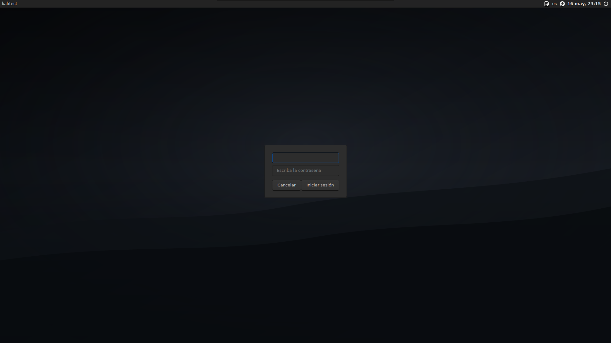

# v0.2.0 - LightDM login theme

## Overview

`v0.2.0` adds an optional LightDM login theme to Kali Desktop Core.

This release focuses on visual consistency outside the i3 session, keeping the same minimal, dark and distraction-free philosophy from the desktop environment.

## Highlights

- Optional LightDM login theme.
- Dark minimal login background with subtle gray gradient.
- New `--login-theme` installer flag.
- New `--without-login-theme` flag.
- Display manager detection.
- Safe dry-run support before touching `/etc/lightdm`.
- Automatic backup of LightDM greeter configuration.
- Dedicated login theme documentation.
- Real login theme screenshot.

## Login theme preview



## Usage

Dry-run first:

```bash
./install.sh --dry-run --login-theme
```

Apply login theme:

```bash
./install.sh --login-theme
```

Apply with a full installation:

```bash
./install.sh --full --theme kali-zen --login-theme
```

## Supported Display Manager

Currently supported:

- LightDM

Not yet supported:

- GDM
- SDDM
- LXDM

## Safety Notes

- This feature is opt-in.
- It modifies `/etc/lightdm/lightdm-gtk-greeter.conf`.
- A timestamped backup is created before changes.
- Restarting LightDM will close the current graphical session.
- Test in a VM or snapshot first.

## Validation

```bash
bash -n install.sh uninstall.sh scripts/*.sh
shellcheck install.sh uninstall.sh scripts/*.sh
./install.sh --dry-run --login-theme
./install.sh --dry-run --full --theme kali-zen --login-theme
```
