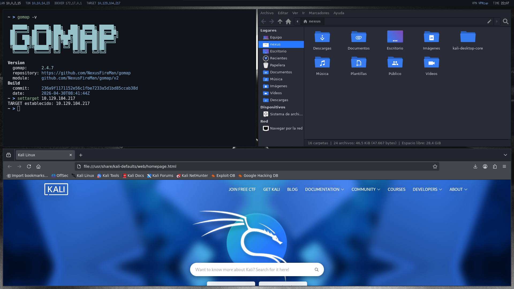

# Flujo de trabajo

## Idea general

El entorno está pensado para reducir fricción en tareas repetitivas de pentesting:

1. Fijar un objetivo con `settarget`.
2. Lanzar escaneos rápidos con `scan`.
3. Parsear puertos con `extractPorts`.
4. Mantener la referencia visual del target en la barra.

## Ejemplo de sesión

```bash
settarget 10.10.11.24
nmap -sC -sV -oN scans/initial.nmap "$TARGET"
extractPorts scans/initial.nmap
scan
```

## Capturas del workflow

### TARGET y gomap


### Escritorio Kali Zen



## Distribución recomendada de workspaces

- `1:term`: shells, tmux, sesiones SSH
- `2:web`: navegador, Burp, documentación
- `3:ops`: escaneos, explotación, listeners
- `4:notes`: markdown, obsidian, apuntes
- `5:misc`: pruebas auxiliares

## Notas para VMs

- Sin compositor para reducir carga.
- Barra basada en shell con refresco controlado.
- Colores oscuros planos sin transparencias.
- Configuración simple de i3 para minimizar consumo y latencia visual.
