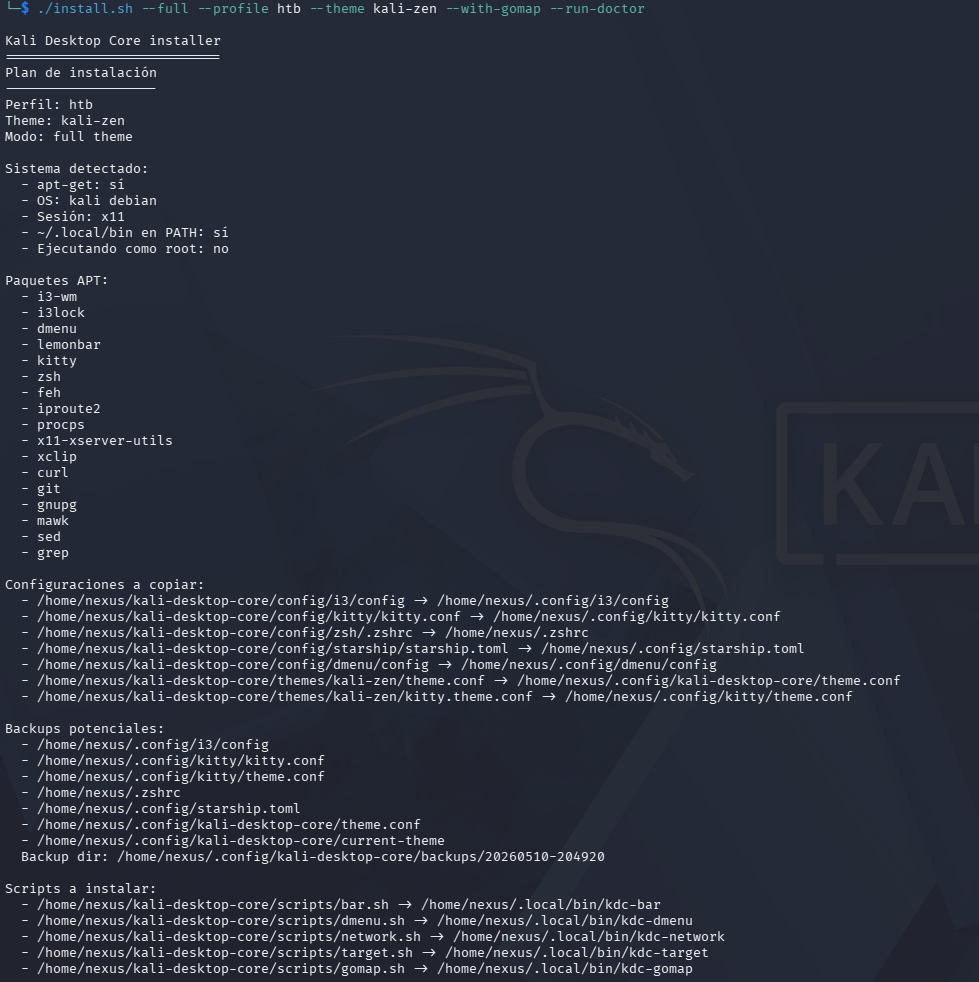
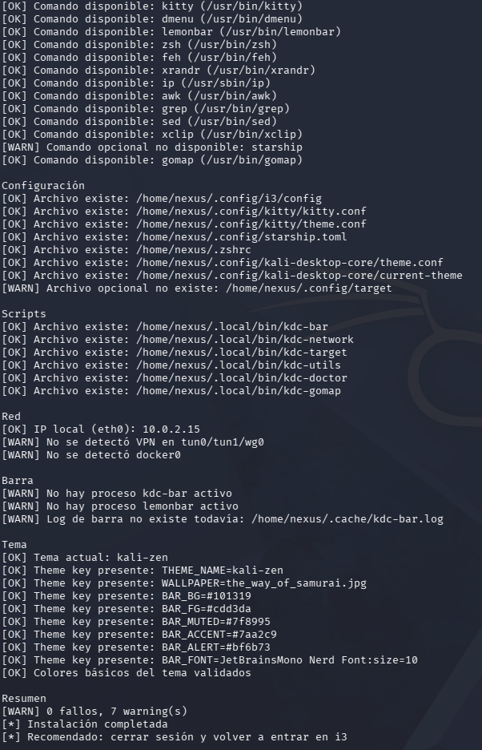
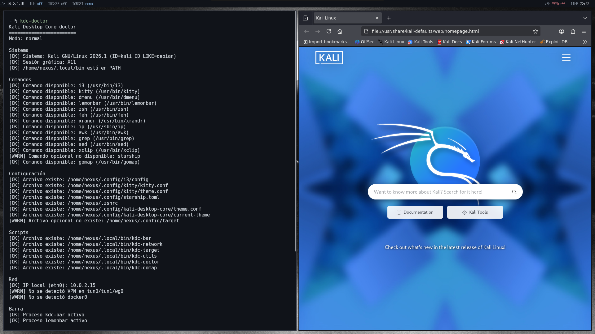

# Instalación

Esta guía documenta el instalador de Kali Desktop Core. El script está pensado para Kali Linux o Debian compatible, especialmente en máquinas virtuales y entornos de laboratorio.

Antes de empezar:

```bash
git clone https://github.com/nexusfireman/kali-desktop-core.git
cd kali-desktop-core
chmod +x install.sh uninstall.sh scripts/*.sh
```

## Instalación completa

```bash
./install.sh
```

Sin argumentos, el instalador mantiene la semántica clásica y equivale a `./install.sh --full`. Muestra un plan previo, instala paquetes base, copia configuraciones, instala scripts y aplica el tema `default`.

Para indicar el modo de forma explícita:

```bash
./install.sh --full
```



## Instalación interactiva

```bash
./install.sh --interactive
```

El modo interactivo usa preguntas simples con `read`. Permite elegir perfil, tema y extras sin depender de herramientas como `dialog`, `whiptail` o `gum`.

## Dry-run

```bash
./install.sh --dry-run --full --theme kali-zen
```

El dry-run muestra qué haría el instalador sin aplicar cambios. No ejecuta `apt-get`, no copia archivos, no crea backups, no modifica `/etc/apt` y no ejecuta instaladores externos.

Es útil para revisar el plan antes de tocar una VM o una instalación de trabajo.


## Perfil HTB con gomap

```bash
./install.sh --full --profile htb --theme kali-zen --with-gomap
./install.sh --full --profile htb --theme kali-zen --with-docker
```

Los perfiles disponibles son:

- `minimal`: base reducida.
- `vm`: perfil general para máquinas virtuales.
- `htb`: orientado a laboratorios tipo Hack The Box.
- `bugbounty`: orientado a sesiones largas de reconocimiento y pruebas web.
- `custom`: punto de partida manual.

En perfiles `htb` y `bugbounty`, `gomap` y Docker se activan por defecto salvo que uses `--without-gomap` o `--without-docker`.

## Reinstalar configuraciones

```bash
./install.sh --configs
```

Este modo copia configuraciones y scripts sin reinstalar dependencias APT. Crea backups con timestamp cuando encuentra archivos existentes.

## Cambiar tema

```bash
./install.sh --theme katana
```

Este modo aplica solo el tema indicado. Los temas se leen desde el directorio `themes/`, por lo que no dependen de una lista hardcodeada en el instalador.

## Diagnóstico

```bash
./install.sh --run-doctor
```

Si `kdc-doctor` ya está instalado, lo ejecuta al final. Si ejecutas `--configs` o `--full`, `scripts/doctor.sh` se instala como:

```bash
~/.local/bin/kdc-doctor
```

También puedes lanzarlo directamente:

```bash
kdc-doctor
kdc-doctor --strict
```

El modo normal permite warnings esperables, como no tener VPN activa. El modo `--strict` trata la barra y `starship` como requisitos más duros.





## Refresco de barra

El instalador deja disponible:

```bash
~/.local/bin/kdc-refresh
```

Este helper lee `~/.cache/kdc-bar.pid` y envía `USR1` a la barra para refrescar LAN, VPN, Docker y TARGET. Las funciones `settarget` y `cleartarget` lo usan automáticamente.

En zsh también queda disponible:

```bash
refreshbar
rb
```

Si conectas una VPN manualmente, por ejemplo con `sudo openvpn`, ejecuta `rb` para forzar el refresco inmediato de la barra.

## Menú de sesión

El instalador deja disponible:

```bash
~/.local/bin/kdc-power-menu
```

La barra muestra el icono `⏻` en la zona derecha. Al hacer click izquierdo abre un menú con `dmenu` para bloquear sesión, cerrar sesión, suspender, reiniciar o apagar. Las acciones de reinicio y apagado piden confirmación antes de ejecutarse.

## Starship

```bash
./install.sh --full --with-starship
./install.sh --full --without-starship
```

Kali Desktop Core incluye una configuración para Starship, pero no ejecuta el instalador externo salvo que uses `--with-starship` o lo confirmes en modo interactivo.

Si eliges `--without-starship`, la shell sigue funcionando con un prompt básico.

## gomap

```bash
./install.sh --full --with-gomap
./install.sh --full --without-gomap
```

Con `--with-gomap`, el instalador registra el repositorio APT:

```text
https://nexusfireman.github.io/gomap
```

Después ejecuta `apt-get update` e instala el paquete `gomap`. El helper `kdc-gomap` queda disponible para reparar o reinstalar ese repositorio manualmente.

## Docker

```bash
./install.sh --full --profile htb --with-docker
./install.sh --full --without-docker
```

Docker es opcional. Cuando se activa, el instalador usa los paquetes del sistema:

- `docker.io`
- `docker-compose`

No se añaden repositorios externos de Docker en esta fase. Si `systemctl` está disponible, el instalador habilita el servicio con `sudo systemctl enable --now docker` y añade el usuario actual al grupo `docker`.

Después de instalar Docker, cierra sesión y vuelve a entrar para usar Docker sin `sudo`.

## Recomendaciones para Kali en VM

- Usa una sesión X11 para i3 y lemonbar.
- Ejecuta el instalador como usuario normal con `sudo`, no como root.
- Comprueba que `~/.local/bin` está en `PATH`.
- Prueba primero con `--dry-run` si ya tienes configuraciones personalizadas.
- Tras instalar o cambiar configs de i3, cierra sesión y vuelve a entrar o recarga i3 con `Mod+Shift+r`.
- Si la barra no aparece, revisa `~/.cache/kdc-bar.log` y ejecuta `kdc-doctor`.
